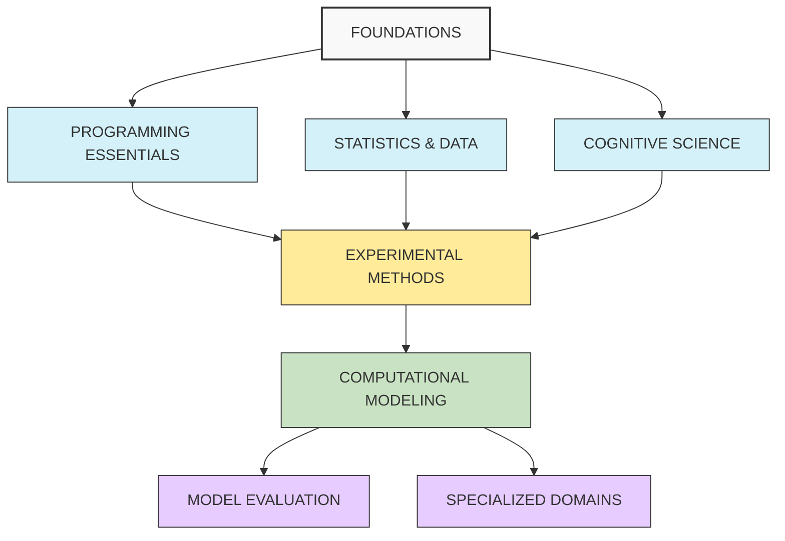

# Paradigms to Practice

An aspiring cognitive scientist's journey from theoretical understanding to practical programming implementation.

## 1. FOUNDATIONS

## **Hermeneutic Foundations**

**_Pareto_**
- [ ] Conjectures and Refutations by Karl Popper
- [ ] The Foundations of Social Research by Michael Crotty

**_Supplementary_**
- [ ] Object Oriented Ontology by Graham Harman
- [ ] The Beginning of Infinity of David Deutsch

**_Extended_**
- [ ] Meaning and Argument by Ernest Lepore

## Knowledge Representation

**_Pareto_**
- [ ] The Book of Why by Judea Pearl
- [ ] Knowledge Representation and Reasoning by Brachman & Levesque

**_Supplementary_**
- [ ] Conceptual Spaces by Peter Gärdenfors
- [ ] Surfaces and Essences by Douglas Hofstadter & Emmanuel Sander

**_Extended_**
- [ ] The Organization of Knowledge by Sowa

## Modes of thinking

### **Computational Thinking**

**_Pareto_**
- [ ] Carpentry: Introducing Computational Thinking
- [ ] HtDP Chapter 1: Fixed-Size Data
- [ ] HtDP Chapter 3: Abstraction
- [ ] Missing Semester: Data Wrangling
- [ ] Missing Semester: Version Control (Git)

**_Supplementary_**
- [ ] Missing Semester: Course overview + the shell
- [ ] What's New in Python 3.12
- [ ] Effective PyCharm (2021 Edition) 
- [ ] Visual Studio Code for Python Developers
- [ ] Think Python: Chapters 1-5: Basic concepts

### **Statistical Thinking**
- [ ] Statistical Rethinking by Richard McElreath
- [ ] An Introduction to Statistical Learning

## System Thinking
- [ ]  Complexity: A Guided Tour by Melanie Mitchell
- [ ]  Networks: An Introduction 
- [ ] Thinking in Systems by Donella Meadows

## Experiment Thinking
- [ ] Methods Matter by Murnane & Willett

## Mathematical thinking
- [ ] Introduction to Mathematical Thinking

## Logical reasoning
- [ ] Think Again: How to Reason and Argue

## 2. PROGRAMMING ESSENTIALS

**Python Core Skills**
- [x] PyBites: Newbie Bites
- [ ] PyBites: Python Beginner
- [ ] Think Python: Chapters 6-10: Functions and iterations
- [ ] Think Python: Chapters 11-15: Data structures
- [ ] Think Python: Chapters 16-20: Classes and inheritance

**Testing & Development**
- [ ] Getting Started with pytest
- [ ] Hello, pytest!
- [ ] The Complete pytest Course
- [ ] PyBites: Pytest

**Advanced Programming**
- [ ] HtDP Chapter 2: Arbitrarily Large Data
- [ ] HtDP Chapter 4: Intertwined Data
- [ ] HtDP Chapter 5: Generative Recursion
- [ ] HtDP Chapter 6: Accumulators
- [ ] PyBites: Algorithms
- [ ] PyBites: Collections Modules

**_Extended Learning_**
- [ ] AI-assisted coding (from Neural Data Science)

## 3. STATISTICS & DATA

**Statistical Foundations**
- [ ] Think Stats
- [ ] Think Bayes: Bayesian probability concepts
- [ ] Think Bayes: Implement basic probabilistic models

**Data Analysis Tools**
- [ ] Pandas: What's New in Pandas 2
- [ ] Pandas: Applied Pandas: Survey Data 
- [ ] Pandas: Effective Pandas 2
- [ ] PyBites: Data Analysis

**Data Visualization**
- [ ] Visualizations: Reactive Web Dashboards with Shiny
- [ ] Neural Data Science: Visualizing neural data
- [ ] Neural Data Science: Exploratory Data Analysis

**_Supplementary_**
- [ ] Think Complexity: Complex systems modeling
- [ ] Think DSP: Digital Signal Processing in Python
- [ ] ML Applications: Effective XGBoost Video Course
- [ ] AI Implementation: Tic-Tac-Toe Python Game Engine With an AI Player
- [ ] NLP: Getting Started with NLP and spaCy

## 4. COGNITIVE SCIENCE

**Theoretical Foundations**
- [ ] ACT-R Cognitive Architecture: Basic concepts
- [ ] Bayesian Cognitive Modeling: Theoretical principles
- [ ] Neural networks for cognition

**Domain-Specific Knowledge**
- [ ] Attention and cognitive control mechanisms
- [ ] Language processing theories
- [ ] Multilingual processing frameworks

**_Extended Learning_**
- [ ] Working Memory Model Implementation
- [ ] Attentional Filter Simulation

## 5. EXPERIMENTAL METHODS

**Basic Experimental Programming**
- [ ] Creating and Presenting Stimuli
- [ ] Processing Responses
- [ ] Scripting an Experiment
- [ ] Analyzing Behavioral Data
- [ ] Analysing Traces

**Specialized Paradigms**
- [ ] AX-CPT Implementation
- [ ] Mouse-tracking Analysis
- [ ] Phonological Cohort Tasks
- [ ] Eye Tracking
- [ ] Common Statistical Tests

**Common Cognitive Experiments**
- [ ] Simple Reaction times
- [ ] Decision times
- [ ] Numerical distance effect
- [ ] Posner's attention cueing task
- [ ] Stroop Effect
- [ ] General audio visual stimulus presentation script
- [ ] Programming a Lexical decision task
- [ ] N-back Task
- [ ] Visual Search

**_Supplementary_**
- [ ] R for Reproducible Scientific Analysis (Carpentry)
- [ ] Programming with MATLAB (Carpentry)
- [ ] fMRI-Based Cognitive Neuroscience for Beginners (Carpentry)

## 6. COMPUTATIONAL MODELING

**Neural Approaches**
- [ ] Neural Data Science: Artificial Neural networks
- [ ] Neural Data Science: Machine Learning for neural data
- [ ] NYU Course: Neural networks for cognitive processes
- [ ] NYU Course: Reinforcement learning models

**Symbolic Approaches**
- [ ] ACT-R Implementation
- [ ] Production systems
- [ ] Memory models

**Probabilistic Approaches**
- [ ] NYU Course: Bayesian cognitive modeling
- [ ] Implementing hierarchical Bayesian models
- [ ] Probabilistic programming for cognitive models

**Simulations**
- [ ] Monte Carlo Estimation
- [ ] Fractals
- [ ] Formal systems

**_Supplementary Neuroscience Data Types_**
- [ ] Neural Data Science: Single Unit Data
- [ ] Neural Data Science: EEG data
- [ ] Neural Data Science: MRI data

## 7. MODEL EVALUATION

**Statistical Techniques**
- [ ] Parameter Recovery
- [ ] Cross-validation techniques
- [ ] Posterior predictive checks
- [ ] NYU Course: Model comparison and fitting
- [ ] AIC, BIC, and Bayes Factors

**Comparing to Human Data**
- [ ] Fitting models to behavioral data
- [ ] Quantifying model-human agreement
- [ ] Visualization of model predictions vs. human data
- [ ] Parameter Fitting for Cognitive Models
- [ ] Cognitive Data Visualization Tools

## 8. SPECIALIZED DOMAINS

**Trilingual Cognitive Control Models**
- [ ] Inhibitory Control Model implementation
- [ ] Language-switching cost simulation
- [ ] Phonological cohort activation models
- [ ] Adaptive Control Hypothesis simulation

**Advanced Applications**
- [ ] Individual differences modeling
- [ ] Computational models of executive function
- [ ] Modeling language control in multilinguals

---

### **Recursive & Meta-Systematic Thinking**
- [ ] Bateson
  - [ ] Steps to an Ecology of Mind by Gregory Bateson
  - [ ] Mind and Nature by Gregory Bateson
- [ ] Hofstader
  - [ ] Gödel, Escher, Bach by Douglas Hofstadter
  - [ ] I Am a Strange Loop by Douglas Hofstadter
- [ ] Seeing Like a State by James C. Scott

## 📚 Digital Garden

This repository documents my path to bridge the gap between paradigmic understanding of cognitive science concepts and their practical implementation through programming.
Digital garden that documents my learning journey in more detail. Visit the site at [https://SamBitSync.github.io/paradigms-to-practice](https://SamBitSync.github.io/paradigms-to-practice).

#